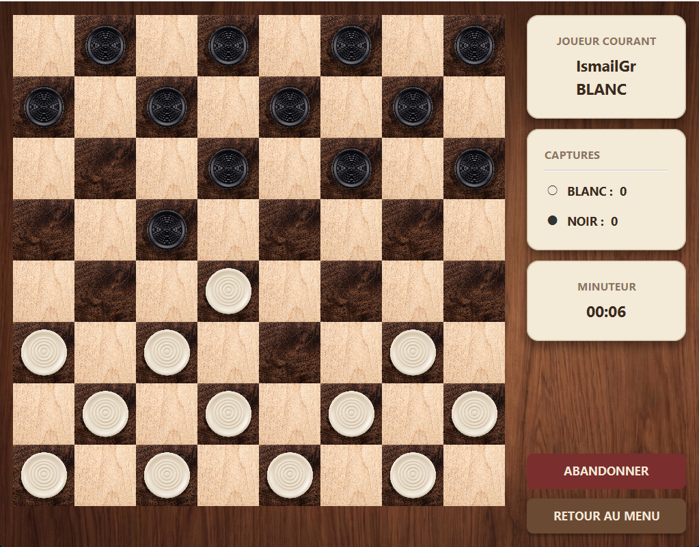

<div align="center">

<br/>

<pre>
     ██╗███████╗██╗   ██╗    ██████╗ ███████╗    ██████╗  █████╗ ███╗   ███╗███████╗███████╗
     ██║██╔════╝██║   ██║    ██╔══██╗██╔════╝    ██╔══██╗██╔══██╗████╗ ████║██╔════╝██╔════╝
     ██║█████╗  ██║   ██║    ██║  ██║█████╗      ██║  ██║███████║██╔████╔██║█████╗  ███████╗
██   ██║██╔══╝  ██║   ██║    ██║  ██║██╔══╝      ██║  ██║██╔══██║██║╚██╔╝██║██╔══╝  ╚════██║
╚█████╔╝███████╗╚██████╔╝    ██████╔╝███████╗    ██████╔╝██║  ██║██║ ╚═╝ ██║███████╗███████║
 ╚════╝ ╚══════╝ ╚═════╝     ╚═════╝ ╚══════╝    ╚═════╝ ╚═╝  ╚═╝╚═╝     ╚═╝╚══════╝╚══════╝
</pre>

### ♟️ Jeu de Dames — Règles Espagnoles · IA Minimax · Interface JavaFX

<br/>


<br/><br/>

[](https://openjdk.org/)
[](https://openjfx.io/)
[](https://maven.apache.org/)
[](https://www.mysql.com/)
[](#architecture)
[](LICENSE)

<br/>

[Démarrage rapide](#-démarrage-rapide) · [Fonctionnalités](#-fonctionnalités) · [Architecture](#-architecture) · [IA](#-intelligence-artificielle) · [Règles](#-règles-du-jeu)

</div>

<br/>

---

## Table des matières

- [Aperçu](#-aperçu)
- [Fonctionnalités](#-fonctionnalités)
- [Stack technique](#-stack-technique)
- [Architecture](#-architecture)
- [Démarrage rapide](#-démarrage-rapide)
- [Intelligence artificielle](#-intelligence-artificielle)
- [Règles du jeu](#-règles-du-jeu)
- [Diagrammes UML](#-diagrammes-uml)

---

## 🎯 Aperçu

**Jeu de Dames** est une application de bureau complète implémentant les règles espagnoles du jeu de dames. Elle propose deux modes (Humain vs Humain et Humain vs IA), une interface graphique avec thème bois, des animations fluides, et un classement de scores persisté en base de données MySQL.

<div align="center">
  
</div>

---

## ✨ Fonctionnalités

| Catégorie | Fonctionnalité |
|---|---|
| Gameplay | Humain vs Humain & Humain vs IA |
| Règles | Prise obligatoire, prise maximale, multi-capture en chaîne |
| Pièces | Pion + Dame volante (toute distance diagonale) |
| IA | Minimax avec élagage alpha-bêta (profondeur 4) |
| Interface | Thème bois, animations de déplacement, drag-and-drop |
| Feedback | Alerte rouge sur les pièces soumises à capture obligatoire |
| Persistance | Scores, joueurs et historique des parties en MySQL |
| Fin de partie | Détection victoire / nulle (40 coups sans progrès) |

---

## 🛠 Stack technique

| Couche | Technologie | Rôle |
|---|---|---|
| Langage | Java 17 | Logique métier et IA |
| Interface | JavaFX 21 | Rendu graphique, animations |
| Éditeur UI | Scene Builder | Création des layouts FXML |
| Build | Maven | Dépendances et lancement |
| Base de données | MySQL 8 via JDBC | Joueurs, parties, scores |
| Serveur local | XAMPP / phpMyAdmin | Environnement de dev |

---

## 🏗 Architecture

Le projet applique un **MVC strict** : le modèle ne contient aucune dépendance JavaFX.

```
com.ensa.checkers/
│
├── Main.java                        ← Point d'entrée JavaFX
│
├── controller/                      ← Couche Contrôleur
│   ├── AppController.java           ← Routeur de navigation
│   ├── MenuController.java
│   ├── LoginController.java
│   ├── GameController.java          ← Implémente BoardViewListener
│   ├── ScoresController.java
│   └── EndGameController.java
│
├── model/                           ← Couche Modèle (0 import JavaFX)
│   ├── Board.java                   ← Grille 8×8 avec apply/undo
│   ├── Piece.java (abstract)
│   ├── Pawn.java / King.java
│   ├── Move.java / Position.java
│   ├── PieceColor.java / GameState.java
│   ├── Game.java                    ← Orchestrateur de partie
│   ├── GameRules.java               ← Prise obligatoire & maximale
│   ├── ai/
│   │   └── MinimaxAI.java           ← Minimax + alpha-bêta
│   ├── player/
│   │   ├── Player.java (abstract)
│   │   ├── HumanPlayer.java
│   │   └── AIPlayer.java
│   └── dao/
│       ├── DatabaseManager.java     ← Singleton JDBC
│       ├── PlayerDAO.java
│       ├── GameDAO.java
│       ├── ScoreDAO.java
│       └── ScoreEntry.java          ← DTO JavaFX Properties
│
└── view/                            ← Couche Vue
    ├── BoardView.java               ← GridPane 8×8 programmatique
    └── BoardViewListener.java       ← Interface événements (clics, drag)
```

<details>
<summary><b>Voir le flux de navigation entre les écrans</b></summary>

<br/>

```
[MenuView]
    │
    ├──► [LoginView]  ──► [GameView]  ──► [EndGameView]
    │                         │                │
    │                    (abandon)         (rejouer) ──► [LoginView]
    │                         │
    │                      (menu) ──────────────────────► [MenuView]
    │
    └──► [ScoresView] ──► [MenuView]
```

</details>

---

## 🚀 Démarrage rapide

### Prérequis

- [JDK 17+](https://adoptium.net/)
- [Maven 3.8+](https://maven.apache.org/download.cgi)
- [XAMPP](https://www.apachefriends.org/) (ou MySQL standalone)

### Installation

**1 — Cloner le dépôt**

```bash
git clone <url-du-repo>
cd game
```

**2 — Créer la base de données**

Ouvrir phpMyAdmin et exécuter :

```sql
CREATE DATABASE checkers;
USE checkers;

CREATE TABLE joueurs (
    id   INT AUTO_INCREMENT PRIMARY KEY,
    nom  VARCHAR(50) UNIQUE NOT NULL
);

CREATE TABLE parties (
    id           INT AUTO_INCREMENT PRIMARY KEY,
    joueur1      VARCHAR(50),
    joueur2      VARCHAR(50),
    gagnant      VARCHAR(50),
    mode         VARCHAR(20),
    date_partie  DATETIME DEFAULT CURRENT_TIMESTAMP
);

CREATE TABLE scores (
    id        INT AUTO_INCREMENT PRIMARY KEY,
    nom       VARCHAR(50) UNIQUE NOT NULL,
    parties   INT DEFAULT 0,
    victoires INT DEFAULT 0,
    points    INT DEFAULT 0
);
```

**3 — Configurer la connexion**

Créer `src/main/resources/config.properties` :

```properties
db.url=jdbc:mysql://localhost:3306/checkers
db.user=root
db.password=
```

> `config.properties` est dans `.gitignore` — ne jamais le committer.

**4 — Lancer**

```bash
mvn javafx:run
```

---

## 🤖 Intelligence Artificielle

L'IA est basée sur l'algorithme **Minimax avec élagage alpha-bêta**.

### Principe

```
                     [État actuel]
                    /              \
           [Coup A]                [Coup B]       ← IA maximise
          /        \              /        \
    [Rép. 1]   [Rép. 2]    [Rép. 3]   [Rép. 4]  ← Adversaire minimise
       ...         ...         ...    ✗ coupé     ← Alpha-bêta élague
```

- **Profondeur 4** — l'IA anticipe 4 demi-coups
- **Élagage alpha-bêta** — abandonne les branches inutiles, x2–x4 plus rapide
- L'IA tourne dans un `Task<Move>` JavaFX pour ne pas bloquer l'interface

### Heuristique d'évaluation

```
Score = Σ valeur(pièces alliées) − Σ valeur(pièces ennemies)
```

| Critère | Valeur |
|---|---|
| Pion | 10 pts |
| Dame | 30 pts |
| Avancement vers la promotion | +0 à +7 pts |
| Contrôle des colonnes centrales | +1 pt |

---

## 📜 Règles du jeu

<details>
<summary><b>Règles complètes (cliquer pour dérouler)</b></summary>

<br/>

**Plateau**
- Grille 8×8, les pièces jouent sur les cases noires uniquement
- 12 pions blancs (rangées 5–7) et 12 pions noirs (rangées 0–2) au départ
- Les Blancs jouent en premier et progressent vers la rangée 0

**Déplacement**
- Un pion avance en diagonale d'une case vers l'avant
- Une dame se déplace de n'importe quelle distance sur une diagonale libre

**Capture**
- La capture est **obligatoire** : si une prise est possible, le joueur doit jouer une capture
- La capture est **maximale** : parmi toutes les prises disponibles, seule la séquence capturant le plus de pièces est autorisée
- La **multi-capture** est possible : une pièce peut enchaîner plusieurs sauts en un seul coup

**Promotion**
- Un pion atteignant la dernière rangée ennemie est promu en dame immédiatement
- La promotion en cours de chaîne **interrompt** la séquence (règle espagnole)

**Fin de partie**
- **Victoire** : l'adversaire n'a plus aucun coup légal (pièces capturées ou bloquées)
- **Nulle** : 40 demi-coups consécutifs sans capture ni promotion

</details>

---

## 📐 Diagrammes UML

Les diagrammes sources (PlantUML) se trouvent dans [`doc/`](doc/).

| Fichier | Contenu |
|---|---|
| [`ClassDiagram_Full.puml`](doc/ClassDiagram_Full.puml) | Toutes les classes et leurs relations |
| [`ClassDiagram_Model.puml`](doc/ClassDiagram_Model.puml) | Couche modèle seule |
| [`ClassDiagram_ViewController.puml`](doc/ClassDiagram_ViewController.puml) | Vue et contrôleurs |
| [`NavigationDiagram.puml`](doc/NavigationDiagram.puml) | Flux de navigation entre écrans |

---

<div align="center">

Fait avec ☕ à l'**ENSA**

</div>
